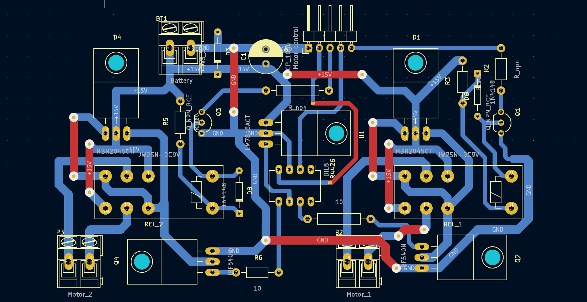

# omod - Open Source Motor Driver
A motor driver used to command two motors. It avoids the complications of an H-bridge
by using a relay to switch the command direction (at the cost of making switching slower).
Checkout [the schematic pdf](schematic.pdf) for a quick impression.
You need KiCad to open the project files.

Here is a picture of the PCB layout:

